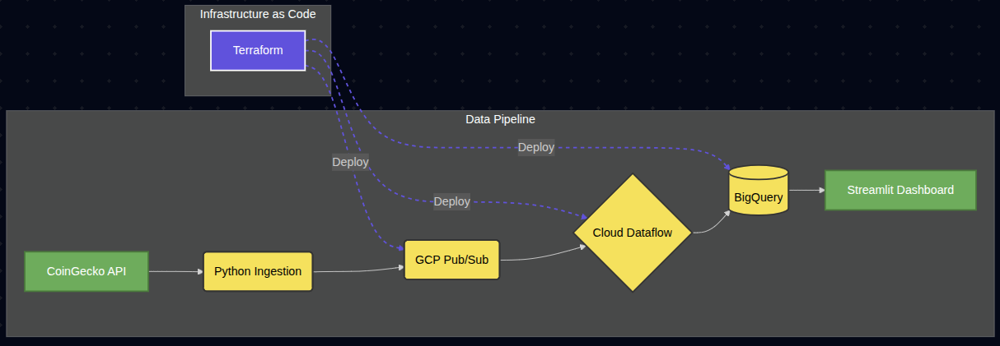

# ₿ Real-Time Bitcoin Streaming ETL Project ₿

## 📖 Overview
This project implements a scalable, real-time streaming ETL (Extract, Transform, Load) pipeline for Bitcoin cryptocurrency data on Google Cloud Platform (GCP). It ingests live price data from the CoinGecko API, processes and aggregates it using Apache Beam on Google Cloud Dataflow, stores the results in BigQuery, and visualizes key metrics on a [live Streamlit dashboard](https://btc-dashboard-app-862053225903.us-central1.run.app/).

## 🏗️ Architecture

The pipeline consists of the following stages:

1.  **Ingestion**: A Python publisher script fetches live Bitcoin data (Price, Volume) from the CoinGecko API and publishes it to **Google Cloud Pub/Sub**.
2.  **Stream Processing**: An **Apache Beam** pipeline running on **Google Cloud Dataflow** reads from the Pub/Sub subscription. It applies:
    - **Windowing**: Fixed 60-second windows.
    - **Aggregation**: Calculates Min, Max, and Average Price, and Total Volume per window.
3.  **Storage**: Aggregated data is written to **Google BigQuery** partitioned tables.
4.  **Visualization**: A [**Streamlit** dashboard](https://btc-dashboard-app-862053225903.us-central1.run.app/) queries BigQuery to display real-time price charts and KPI cards.
5.  **Infrastructure**: Managed via **Terraform**.

## 🛠️ Tech Stack

-   **Language**: Python 🐍
-   **Cloud Provider**: Google Cloud Platform (GCP) ☁️
-   **Infrastructure as Code**: Terraform 🏗️
-   **Containerization**: Docker 🐳
-   **Compute**: Google Compute Engine (GCE), Cloud Run ⚡
-   **Data Services**: Pub/Sub, Dataflow, BigQuery, Secret Manager 📡

## 📂 Project Structure

-   `src_pipeline/pipeline/pubsub/pub_sub.py`: Publisher script that connects to CoinGecko and pushes data to Pub/Sub.
-   `src_pipeline/pipeline/dataflow/dataflow.py`: Apache Beam pipeline for streaming analytics and BigQuery insertion.
-   `btc_dashboard/main.py`: Streamlit application for data visualization.
-   `terraform_gcp_resources/main.tf`: Terraform configuration defining GCP resources (APIs, Service Accounts, IAM, Artifact Registry).

## ✨ Key Features

-   **Secure Credential Management**: Uses GCP Secret Manager for accessing API keys and Service Account credentials.
-   **Robust Error Handling**: The pipeline includes logic to handle API errors (HTTP 429/500) and malformed data.
-   **Scalability**: Leverages serverless technologies (Pub/Sub, Dataflow, Cloud Run) to handle varying loads.
-   **IaC**: Fully reproducible infrastructure state using Terraform.

## 🚀 Future Improvements

-   Implement Cloud Monitoring alerts for pipeline lag or ingestion failures.
-   Add Simple Moving Average (SMA) calculations to the Dataflow pipeline.
-   Optimize BigQuery costs with clustering on the `event_timestamp`.
-   Implement web sockets to reduce latency of chart updates. 
-   Implement machine learning models to utilize time series analysis to predict future price trends of Bitcoin.

## 📜 License

This project is for educational purposes and portfolio demonstration.